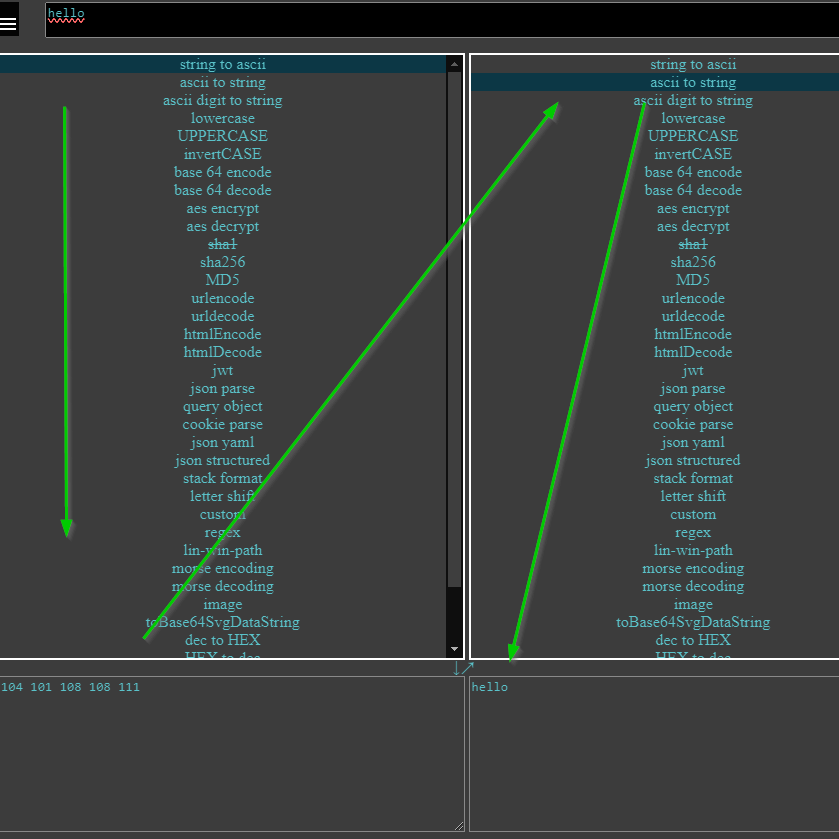

### Motivation

i have a very low threshhold for doing stuff twice

### Idea

1. input text at the top
2. apply transformation
3. pipe into next transformation

missing transformations ?
just file an issue :) and ill see

badly documented features: 
- you can take a photo ,paste one into the text field,or drag and drop it into the text field and it will try image 2 text and qr code analyze on it
- if you have text that only makes sense with one transformation , upon pasting it, the correct tranformation should be automatically matched

### Rules
leave me a star if u think its neat 😇